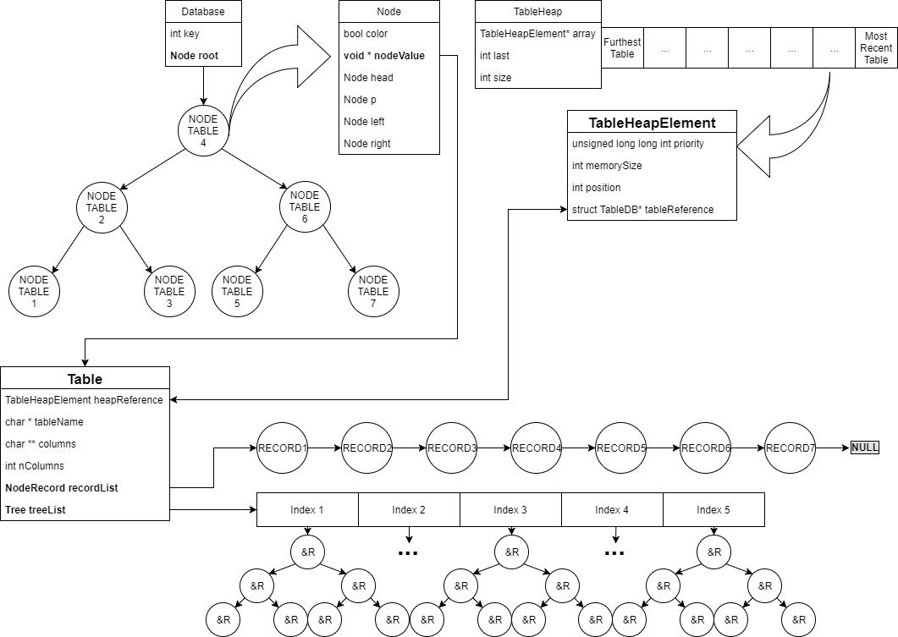

# SbornDB – documentazione
---

1. **Premessa**
2. **Gestione della memoria**
    * 2.1 Premessa
    * 2.2 Assunzioni
    * 2.3 Scopo
    * 2.4 Definizione delle caratteristiche
    * 2.5 Descrizione
3. **Strutture dati**
    * 3.1 Linked List
    * 3.2 Red-Black Tree
        * _3.2.1 struct RBT_
        * _3.2.2 struct RBTNode_
        * _3.2.3 Uso_
    * 3.3 Heap con Update Dinamico
    * 3.4 Strutture
        * _3.4.1 Struttura TableDB_
        * _3.4.2 Struttura ParseResult_
        * _3.4.3 Struttura QueryResultElement_
4. **Corpo centrale**
    * 4.1 Fase di Inizializzazione
    * 4.2 Fase di Parsing
    * 4.3 Fase di Ricerca
    * 4.4 Fase di Esecuzione
        * _4.4.1 Fase di Controllo_
        * _4.4.2 Creazione_
        * _4.4.3 Inserimento_
        * _4.4.4 Selezione_
    * 4.5 Fase di Liberazione della memoria
5. **Parser**
6. **Riferimenti Esterni**


---
# 1. Premessa
In questo file sono racchiuse tutte le specifiche sul funzionamento del database, sui suoi costi in termini di velocità e di memoria.
Il progetto è diviso in: gestione della memoria, strutture dati, corpo centrale e parser.
Ogni parte verrà analizzata nel dettaglio e alla fine verranni discussi i costi computazionali di tempo e spazio.

---
# 2. Gestione della memoria
## 2.1 Premessa
Un reale database, di quelli che possiamo trovare in sistemi enterprise e di produzione, possono immagazzinare una grande quantità di dati. In fase di progettazione abbiamo deciso di emulare, per quanto possibile, le capacità di questi sistemi, cercando il miglior compromesso tra complessità di implementazione e prestazioni con dataset corposi.

## 2.2 Assunzioni
1.	I file di testo devono mantenere la struttura indicata nelle specifiche del progetto.
2.	Non si possono creare altri file su disco, per salvare dati in forma più comoda all’uso con certe strutture dati.
3.	La gestione della memoria deve essere efficiente come il resto del sistema.
Il database mantiene i dati su disco secondo le specifiche del progetto, in RAM vengono usate strutture dati viste al corso per avere ottime prestazioni. 

## 2.3 Scopo
Limitare l’utilizzo di RAM per mantenere alte le prestazioni di tutto il sistema, senza rallentare le query.

## 2.4 Definizione delle caratteristiche
1.	Possibilità di definire una soglia di memoria, sopra la quale è necessario deallocare per avere altra memoria.
2.	Deve permettere al database di caricare almeno una tabella per volta.
3.	Migliorare il processo di allocazione e deallocazione tramite un sistema di cacheing basilare.

## 2.5 Descrizione
### 2.5.1 Perchè un limite di memoria
Si è voluto simulare un ambiente in cui ci siano limiti di memoria: per questo si è pensato di imitare il funzionamento di un sistema di caching temporale, ovvero assegnare delle priorità alle tabelle ed eliminare, in caso di eccessivo uso della memoria, quelle che non vengono utilizzate da più tempo.
Ovviamente, questo sistema basilare può comportare un maggior numero di allocazioni/deallocazioni, a discapito delle performance, in caso di accessi a tabelle random e non sequenziali, ma in casi di disponibilità di memoria ridotta si pensa essere la soluzione migliore.
### 2.5.2 Modalità di implementazione
Il sistema è stato implementato come un heap con update dinamico. Come chiave si è utilizzato un intero, che descrive, in ordine temporale, il momento in cui viene effettuata l'ultima operazione alla tabella (creazioni/inserimenti/query) e come valore la tabella stessa. Il funzionamento è simile a una coda di priorità con update dinamico.
Esiste anche un contatore che serve a tener traccia della quantità di memoria totale utilizzata dal programma per gestire tutte le tabelle.
### 2.5.3 Operazioni nell'heap a seguito delle query
Quando una tabella viene creata, questa viene allocata e inserita nella coda. Siccome l’intero che rappresenta la chiave dell’heap descrive l’istante in cui la tabella viene usata, questa tabella avrà la chiave maggiore di tutte le altre all’interno dell’heap.
La coda di priorità mantiene in testa la tabella utilizzata meno di recente, ossia quella con chiave minore.
Quando viene fatta una qualsiasi operazione su una tabella già esistente nell’heap, la sua chiave viene aggiornata (update dinamico).
Nel caso in cui sia necessario allocare memoria per una tabella quando lo spazio disponibile è esaurito, vengono eliminate dalla memoria le tabelle dalla cima della coda, finche non rimane abbastanza spazio, o finche non c'è una sola tabella.
### 2.5.4 Update Dinamico con complessità logaritmica
Per poter effettuare un update dinamico sull'heap, con complessità logaritmica, è necessario un riferimento reciproco tra l'elemento nell’heap e la tabella corrispondente, infatti in entrambe le strutture è presente un puntatore (nell'elemento dell'heap alla tabella e nella tabella all'elemento dell'heap).
L’heap è una struttura dati vista a lezione, è stata aumentata per gestire l’update dinamico in O(log n).
Per la implementazione si è preso spunto da un paper redatto da O. Tamir, A. Morrison and N. Rinetzky (link al paper https://www.cs.tau.ac.il/~mad/publications/opodis2015-heap.pdf ), osservando in particolare la sezione numero 3 : “A Sequential Heap with Mutable Priorities”

---
# 3. Database e Strutture dati
Il database è accessibile da un unico puntatore dichiarato globale e statico. È stata fatta questa scelta in quanto si assume di lavorare sempre su un unico database, seguendo le linee guida del progetto. In questo modo si evita di appesantire lo stack di sistema a ogni chiamata di funzione. Segue uno schema grafico della sua struttura interna e la spiegazione di ogni elemento di cui è composto.



Nel database vengono utilizzate:

1.	Linked List
2.	Red-Black Tree 
3.	Heap con Update Dinamico

## 3.1 Linked List
Le linked list utilizzate sono implementate nel modo classico.

## 3.2 Red-Black Tree
I Red-Black Tree (d’ora in poi chiamati anche RBT) utilizzati sono stati modificati per l’applicazione specifica. L’implementazione delle funzioni core si è ispirata allo pseudo-codice presente sul libro di testo consigliato dal docente “Introduction to Algorithms” di Cormen, Leiserson, Rivest e Stein.

### 3.2.1 Struct RBT
La struct utilizzata per rappresentare l’albero contiene:

1.	Puntatore alla radice ```struct RBTNode * root```
2.	Chiave intera ```int key```. Il valore della key può essere:
    * Key == -2 : indica che il RBT contiene tabelle
    * Key == -1 : non utilizzato, riservato dalla funzione ```searchColumnIndex()```
    * 0 ≤ Key ≤ MAX_INT : indica che il RBT contiene puntatori a record, e il valore di key rappresenta l’indice della colonna nella tabella.

### 3.2.2 Struct RBTNode
La struct utilizzata per rappresentare i nodi dell’albero contiene:

1.	Colore del nodo ```bool color```
2.	Puntatore alla radice ```struct RBTree * head```
3.	Puntatore al nodo padre ```struct RBTree * p```
4.	Puntatore al nodo destro ```struct RBTree * r```
5.	Puntatore al nodo sinistro ```struct RBTree * l```
6.	Puntatore al record o alla tabella ```void * nodeValue```

### 3.2.3 Uso
La struct Database è un RBT contenente le tabelle caricate in memoria.

## 3.3 Heap con Update Dinamico
L’Heap è stato modificato, aggiungendo la possibilità di fare Update Dinamici in tempo logaritmico, ispirandosi al paper redatto da O. Tamir, A. Morrison e N. Rinetzky [1], osservando in particolare la sezione numero 3: “A Sequential Heap with Mutable Priorities”.

## 3.4 Strutture
### 3.4.1 Struttura TableDB
La struttura tabella (```struct TableDB```) contiene:

1.	Il nome della tabella ```char * name```
2.	I nomi delle colonne ```char ** columns```
3.	Il numero delle colonne ```int nColumns```
4.	La lista di record ```struct Record * recordList```
5.	L’array degli RBT ```struct RBTree* treeList```

L’array degli RBT contiene tanti RBT quante sono le colonne della tabella, e ognuno di questi mantiene i record ordinati per quel campo.

### 3.4.2 Struttura ParseResult
```struct ParseResult``` ha un campo per ogni possibile informazione di cui può essere necessario fare il parse e un campo di controllo (```bool success```) che indica se esso è andato a buon fine o meno.

### 3.4.3 Struttura QueryResultElement
```struct QueryResultElement``` è una struttura che serve a contenere il risultato delle query. È una semplice linked list, in cui il campo “occurrence” viene utilizzato nelle query “group by” per memorizzare le occorrenze del valore e il campo “nodeValue” punta al record a cui si vuol riferire questo nodo della lista.

---
# 4. Corpo centrale
Il corpo centrale è diviso in tre parti principali:

1.	Parse della query
2.	Recupero della tabella
3.	Esecuzione della query

A cui si aggiungono tre fasi minori:

*	Inizializzazione del database
* 	Controllo query _(tra parsing ed esecuzione della query)_
*	Deallocazione della memoria _(dopo aver eseguito la query)_

## 4.1 Fase di Inizializzazione
Viene inizializzata la struttura che conterrà il database e l’heap per la gestione della memoria.
Viene eseguita solo una volta, alla prima chiamata della funzione “executeQuery” e poi viene saltata.

## 4.2 Fase di Parsing
Viene chiamata la funzione “parseQuery” che, appunto, fa il parsing della query passata per argomento alla funzione “executeQuery”.
Essa ritorna una struttura chiamata “ParseResult” che contiene il risultato del parsing (a buon fine o meno) e tutte le informazione necessarie per eseguire la query/creazione/inserimento.
Se la queryString non era correttamente formattata (quindi il parse non ha successo), viene interrotta l’esecuzione con ritorno a false.

## 4.3 Fase di Ricerca
Viene ricercata la tabella sul cui si vuole lavorare nel database tramite la funzione “searchTableDb”. Se viene trovata, viene aggiornata la sua chiava nella coda di priorità per la gestione della memoria.
Altrimenti si prova a caricarla da file con la funzione “loadTableFromFile”.
Questa fase rilascia una struttura di tipo “Table” che può contenere o no una tabella in base al successo del caricamento.

## 4.4 Fase di Esecuzione
Viene eseguita la query vera e propria.

### 4.4.1 Fase di Controllo
Prima di tutto, viene controllata la query/creazione/inserimento ora che si conoscono tutte le informazione della tabella a cui si sta facendo riferimento (se è stata caricata in memoria dalla fase precedente).
Dopodichè la query viene eseguita in base al suo tipo.

### 4.4.2 Creazione
Se la tabella non esiste (quindi non era stata caricata), viene creata. Prima viene generato il file e poi viene creata la struttura della tabella nel database.

### 4.4.3 Inserimento
Se la tabella esiste (quindi è stata caricata), viene eseguito l’inserimento di un record. Prima viene aggiornato il file e poi aggiunto il record nella struttura della tabella a database.

### 4.4.4 Selezione
Se la tabella esiste, viene eseguita la selezione. Attraverso la funzione “querySelect” viene creata una struttura di tipo “QueryResultList” contenente il risultato della query
Dopodichè viene generato il log della query eseguita, chiamando la funzione “generateLog”.
Viene poi liberata la memoria contenente la struttra della “QueryResultList”.

## 4.5 Fase di Liberazione della memoria
Vengono liberate tutte le strutture utilizzate per la query in corso. Nel nostro caso solo una che rimane ancora non liberata, ossia il “ParseResult”

# 5. Parser
Il parser deve gestire un numero limitato di possibili query, ed ha quindi una struttura molto semplice.
Tutta l'operaIone di parsing viene eseguita in tempo lineare rispetto alla lunghezza della query.
L'entry point del parser è la funzione `ParseResult parseQuery (char * query)`, dalla quale vengono chiamate varie funzioni per capire il tipo di query e farne l'analisi. Durante l'esecuzione viene usato direttamente un puntatore `char *`, che segue il progresso lungo la query tramite degli incrementi.
La funzione `parseQuery` restituisce un puntatore `ParseResult` alla `struct ParseResult`, così composta: 

``` c
struct ParseResult {
    bool success;
    char * tableName;
    int queryType;
    char ** columns;
    int nColumns;
    char ** fieldValues;
    int querySelector;
    char * keyName;
    char * key;
    int order;
    int parseErrorCode;
};
```
dove:

1. `bool success`: contiene il risultato dell'analisi, e di conseguenza la validità sia della query che dei dati nella struttura
 
2. `char * tableName`: contiene il nome della tabella su cui agisce la query
 
3. `int queryType`: contiene il codice numerico identificativo del tipo di query, tra i possibili seguenti:
    * Create Table: `-1`
    * Select con filtro Where: `0`
    * Select con filtro Order By: `1`
    * Select con filtro Group By: `2`
    * Insert Into: `3`
    * Select senza filtri: `4`
    * No Query: `6`
 
4. `char ** columns`: contiene i puntatori di tipo `char *` ai nomi delle colonne interessate dalla query.
 
5. `int nColumns`: contiene il numero di colonne interessate dalla query, e di conseguenza anche il numero di puntatori presenti dentro il campo `char ** columns`.
 
6. `char ** fieldValues`: usata solo nelle query di tipo Insert Into, contiene `nColumns` puntatori di tipo `char *` alle stringhe contenenti i valori da inserire
 
7. `int querySelector`: usato solo in query di tipo Select con filtro Where, contiene il codice numerico identificativo dell'operatore:
    * Equal `0`
    * Greater `1`
    * Lesser `2`
    * Greater Equal `3`
    * Lesser Equal `4`
    * No Operator `5`
 
8. `char * keyName`: usato nelle query di tipo:
    * Select con filtro Where, per contenere il nome del campo interessato dalla condizione where.
    * Select con filtro Group By, per contenere il nome del campo per cui raggruppare i record.
    * Select con filtro Order By, per contenere il nome del campo per cui ordinare i record.
 
9. `char * key`: usato solo nella query di tipo Select con filtro Where, per contenere il valore da paragonare quando si verifica la condizione della query.
 
10. `int order`: usato solo nelle query di tipo Select con filtro Order By, contiene l'ordine desiderato. Può assumere i valori:
    * ASC 0
    * DESC 1
 
11. `int parseErrorCode`: contiene un identificativo numerico hardcoded nel sorgente, unico al punto in cui il parse ha fallito l'esecuzione e terminato prematuramente. Controllando il codice si può facilmente risalire al punto in cui si è manifestato il problema. I codici di errore sono suddivisi in classi:
    * `0-99`: Errori Generali
    * `101-199`: Errori durante il parsing di una query "Create Table"
    * `201-299`: Errori durante il parsing di una query "Insert Into"
    * `301-399`: Errori durante il parsing della parte senza filtri di una query "Select"
    * `401-499`: Errori durante il parsing della parte finale di una query "Select Where"
    * `501-599`: Errori durante il parsing della parte finale di una query "Select Group By"
    * `601-699`: Errori durante il parsing della parte finale di una query "Select Order By"
 
## 6 Riferimenti esterni:
[1] <a href="https://www.cs.tau.ac.il/~mad/publications/opodis2015-heap.pdf">https://www.cs.tau.ac.il/~mad/publications/opodis2015-heap.pdf</a>
